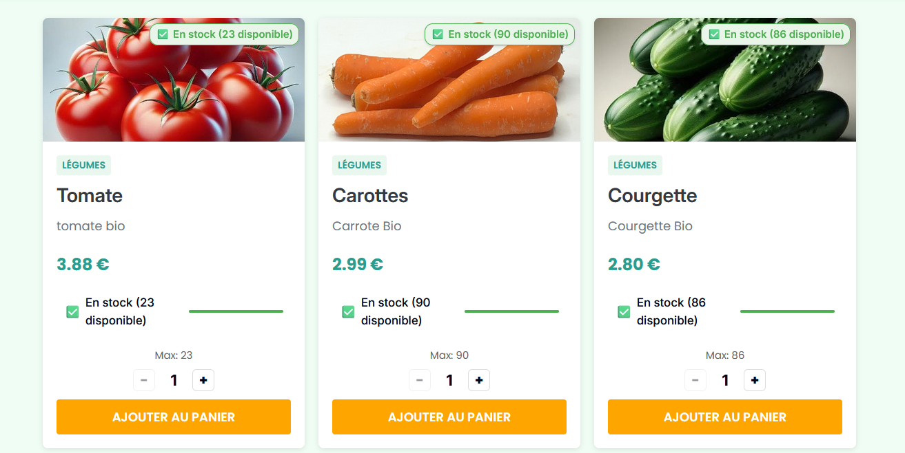
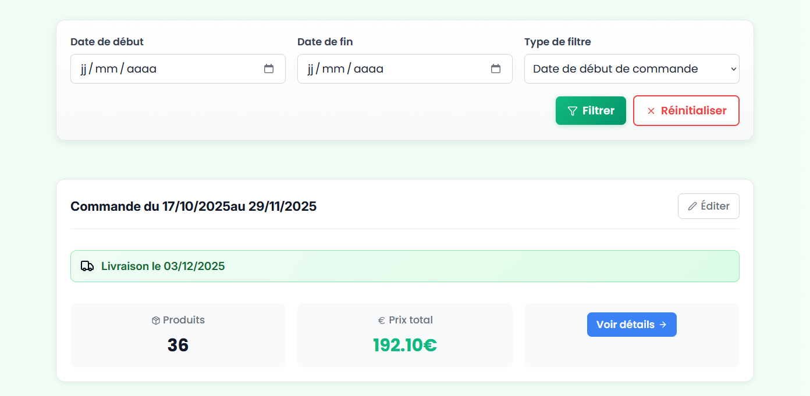
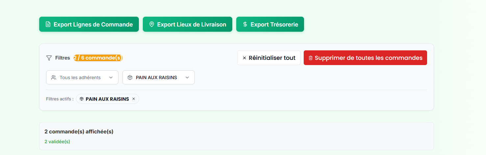
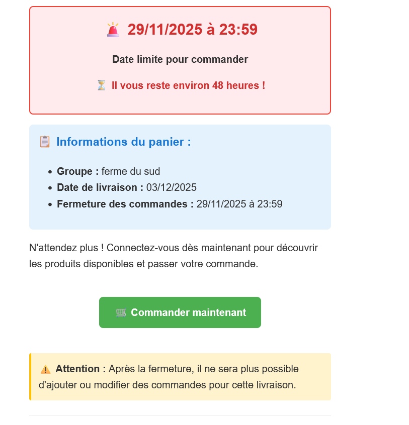

# 🌾 CollectivHub

> Plateforme e-commerce complète pour coopératives AMAP


## 📋 Vue d'ensemble

CollectivHub est une plateforme SaaS développée pour répondre aux besoins spécifiques des coopératives AMAP (Associations pour le Maintien d'une Agriculture Paysanne). La solution permet de gérer l'ensemble du cycle de vie des commandes, des membres et de la logistique de distribution.

## 🎯 Problématique

Les coopératives AMAP ont besoin d'une plateforme pour gérer les commandes, les membres et la logistique de manière centralisée et efficace. Les solutions existantes (Excel, emails) créent des inefficacités, des erreurs et une charge administrative importante.

## 💡 Solution

Plateforme complète pour AMAP avec gestion des groupes, commandes, membres et statistiques. L'application centralise toutes les opérations et automatise les processus répétitifs.

## ✨ Fonctionnalités principales

### 🛒 Catalogue de produits
- Affichage des produits avec images
- Gestion des stocks en temps réel
- Indicateur de disponibilité visuel
- Prix unitaires et informations détaillées
- Système d'ajout au panier intuitif

### 🛍️ Panier de commandes
- Création et modification de panier
- Calcul automatique des totaux
- Gestion des quantités maximum par produit
- Interface claire avec récapitulatif complet
- Validation en un clic

### 📦 Gestion des commandes
- Historique complet des commandes
- Filtrage intelligent par dates et type
- Statuts de commandes (validée, en attente, payée)
- Suivi des livraisons avec dates précises
- Export des données (lignes de commande, lieux de livraison, trésorerie)

### 📊 Exports et rapports
- **Export CSV des lignes de commande** - Pour la préparation des paniers
- **Export des lieux de livraison** - Organisation logistique
- **Export trésorerie** - Suivi comptable
- Filtres par adhérents et produits

### 📧 Système de notifications intelligentes
- **Email de modification automatique** - Notification si produit retiré du panier
- **Rappels 48h avant clôture** - Email aux clients n'ayant pas commandé
- Alertes de dates limites avec compte à rebours
- Notifications de livraison

### ⏰ Gestion temporelle
- Périodes de commande avec dates de début/fin
- Date limite de commande clairement affichée
- Compte à rebours en temps réel
- Fermeture automatique des paniers
- Informations du groupe (nom, date de livraison)

### 🔐 Authentification & Sécurité
- Système de connexion/inscription sécurisé
- Gestion des rôles et permissions (admin, producteur, membre)
- Protection des données sensibles

### 🌐 Multilingue
- Support français et anglais (extensible)
- Interface adaptée selon les préférences

### 📱 Design responsive
- Interface adaptée à tous les écrans
- Mobile-first approach
- Design moderne avec code couleur intuitif (vert pour disponible, rouge pour alertes)

## 🛠️ Stack technique

### Frontend
```
React 18 avec TypeScript
├── Zustand (state management)
├── React Router (navigation)
├── Composants réutilisables (common/ + layout/)
├── Services API dédiés
└── i18n pour l'internationalisation
```

### Backend
```
Symfony 6.x
├── API Platform
├── Doctrine ORM
├── JWT Authentication
└── Architecture modulaire
```

### Base de données
- **MySQL** - Base de données principale
- Architecture relationnelle optimisée

### DevOps & Outils
- **Docker** - Conteneurisation
- **Git** - Versioning
- **Vite** - Build tool
- **TypeScript** - Type safety

## 📁 Architecture Frontend

```
collectiv-hub-front/
├── src/
│   ├── components/         # Composants réutilisables
│   │   ├── common/        # Button, Input, etc.
│   │   └── layout/        # Header, Footer, etc.
│   ├── pages/             # Pages de l'application
│   ├── services/          # Services API
│   ├── stores/            # Zustand stores (gestion d'état)
│   ├── hooks/             # Custom React Hooks
│   ├── utils/             # Fonctions utilitaires
│   ├── types/             # Types TypeScript
│   └── locales/           # Traductions i18n
└── vite.config.ts         # Configuration Vite
```

## 📊 Résultats

✅ **~100 utilisateurs actifs** - Adoption progressive par les membres AMAP  
✅ **8 groupes AMAP** - Déploiement multi-instances  
✅ **Gestion complète des coopératives** - De la commande à la distribution  
✅ **En production depuis 2024** - Stabilité et fiabilité prouvées  

## 🖼️ Captures d'écran

### Catalogue de produits

*Affichage des produits avec stocks en temps réel et système d'ajout au panier*

### Panier de commandes

*Récapitulatif complet avec calcul automatique des totaux*

### Gestion des commandes

*Interface d'administration avec filtres et exports CSV*

### Système de filtres et exports

*Exports intelligents : lignes de commande, lieux de livraison, trésorerie*

### Notifications automatiques

*Email automatique en cas de retrait de produit du panier*

### Dates limites et rappels

*Système de rappel 48h avant la clôture des commandes*

## 🚀 Défis techniques relevés

### 1. Système de notifications automatiques
Développement d'un système de notifications par email complexe :
- Envoi automatique en cas de modification de panier (produit retiré)
- Rappels automatiques 48h avant clôture aux clients n'ayant pas commandé
- Gestion des templates d'emails personnalisés
- Queue de traitement pour éviter les surcharges

### 2. Gestion des stocks en temps réel
Mise en place d'un système de synchronisation instantanée :
- Mise à jour dynamique des disponibilités
- Verrouillage des quantités lors de l'ajout au panier
- Libération automatique en cas d'abandon
- Indicateurs visuels de disponibilité

### 3. Exports CSV multiples
Création de 3 types d'exports différents optimisés :
- Export des lignes de commande pour la préparation des paniers
- Export des lieux de livraison pour l'organisation logistique
- Export trésorerie pour le suivi comptable
- Filtres avancés par adhérents et produits

### 4. Architecture multi-tenant
Mise en place d'une architecture permettant à plusieurs AMAP d'utiliser la plateforme de manière isolée et sécurisée, chaque groupe ayant ses propres dates, produits et membres.

### 5. Gestion temporelle complexe
Développement d'un système de périodes de commandes avec :
- Dates de début et fin de commande configurables
- Compte à rebours en temps réel
- Fermeture automatique des paniers
- Rappels automatisés avant échéance

### 6. State management complexe
Utilisation de Zustand pour gérer :
- État du panier en temps réel
- Synchronisation multi-onglets
- Persistance des données
- Gestion des permissions par rôle

## 🔒 Note importante

**Le code source de ce projet est privé** car il contient de la logique métier confidentielle, des configurations clients sensibles et des données d'AMAP partenaires. Ce repository sert de présentation professionnelle du projet.

## 🎓 Apprentissages clés

- **Architecture full-stack complexe** - Gestion complète d'une plateforme e-commerce AMAP
- **Système de notifications automatiques** - Emails déclenchés par événements (modifications, rappels 48h)
- **Exports CSV optimisés** - Génération de 3 types d'exports différents avec filtres avancés
- **Gestion des stocks en temps réel** - Synchronisation instantanée et verrouillage des quantités
- **State management avancé** - Zustand pour gérer panier, commandes et permissions
- **Gestion temporelle** - Périodes de commandes avec compte à rebours et fermeture automatique
- **Architecture multi-tenant** - Isolement sécurisé entre différents groupes AMAP
- **Intégration API RESTful** - Communication frontend/backend avec Symfony
- **UX pour utilisateurs métier** - Interface intuitive adaptée aux producteurs et membres AMAP
- **Déploiement et maintenance** - Application en production avec ~100 utilisateurs actifs

## 🔗 Liens

- 🌐 **Portfolio** : [nekodigital.fr](https://nekodigital.fr)
- 📱 **Case study complète** : [nekodigital.fr/projets/collectivhub](https://nekodigital.fr/projets/collectivhub)
- 💼 **Contact** : [contact@nekodigital.fr](mailto:contact@nekodigital.fr)

## 📫 Contact

Intéressé par ce projet ou par mes services de développement ?  
Contactez-moi via [NekoDigital](https://nekodigital.fr)

---

**Développé par [NekoDigital](https://nekodigital.fr)** - Conception & développement web  
*Transformer vos idées en applications web modernes et performantes*
